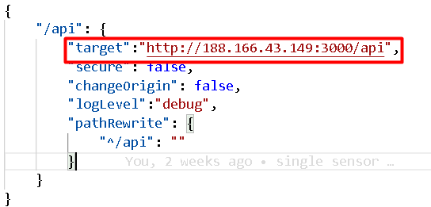
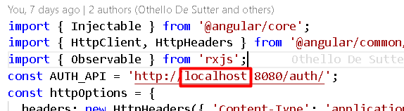

# Frontend

This project was generated with Angular, here is the default Angular: [README](angular.md)

## download/clone

Download or clone the github project to a local directory, make sure the backend and the frontend are located in the same folder. Next open the project in an IDE of your choise, we used Visual Studio Code. Next you open a terminal in the root of the project.

## First start

Now we will install all the required modules to run the project. In the terminal you need to run

```
npm install
```

to install all node modules.

## Update project

Before you start, you first need to set all the variables. Go check out https://github.com/Wolkjes/server and Grafana setup to check out how to set those veriables.

You also need to change the `proxy.config.json`file. There you see a variable `target`, you **ONLY** need to change the IP. So **don't change :3000 and /api**

</img>

In all the `service.ts files` located in the directory `service`, there is a link with `localhost`in, this should be changed to your`IP` address.

</img>

## Run project

Now we can start the project, in the terminal run:

```
ng serve
```

Navigate to http://localhost:4200/. The app will automatically reload if you change any of the source files.

## Environment files

At the moment we don't have environment files, but you can implement these yourself. Because this isn't very safe for the apllication.

## Backend and server files

Clone the backend from here: [https://github.com/Wolkjes/backend] and follow the instructions in the README to start the backend

Clone the server files from here: [https://github.com/Wolkjes/server] and follow the instructions in the README to run the docker-compose file

## Add sensor

First update your sensor to the latest version: [https://github.com/Wolkjes/operame]

Then connect your sensor to the network and enter the correct IP-address:

<ol>
    <li>Turn the sensor on</li>
    <li>Press the top button</li>
    <li>The sensor makes a wifi connection, connect to this with another device</li>
    <li>Then you will get a message to login on this wifi connection, open this and the configuration page will open in the browser</li>
    <li>Select the correct SSID of the password and enter the password of that SSID</li>
    <li>Enter the correct ip-address in the MQTT ip address box. This is the ip where you run all the server files (docker-compose file)</li>
    <li>Go to the bottom of the page and click on Save</li>
    <li>Then restart your sensor by clicking restart at the top of the page</li>
</ol>
